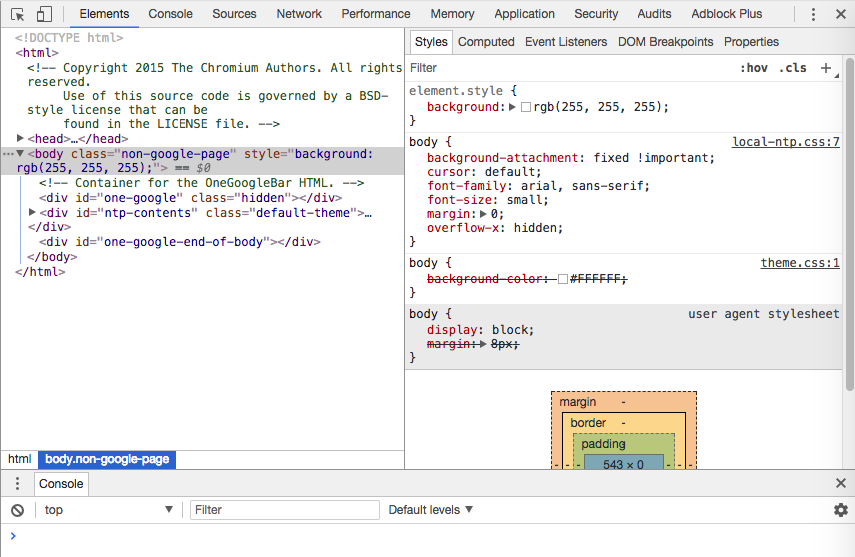
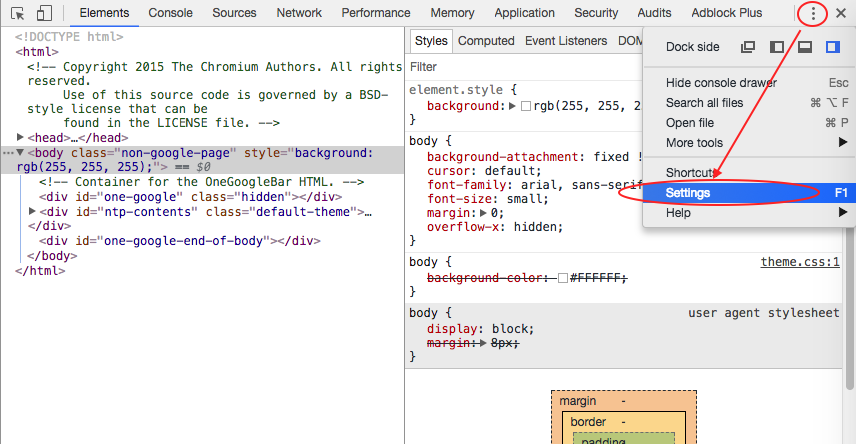
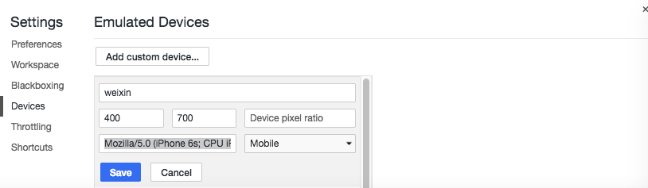
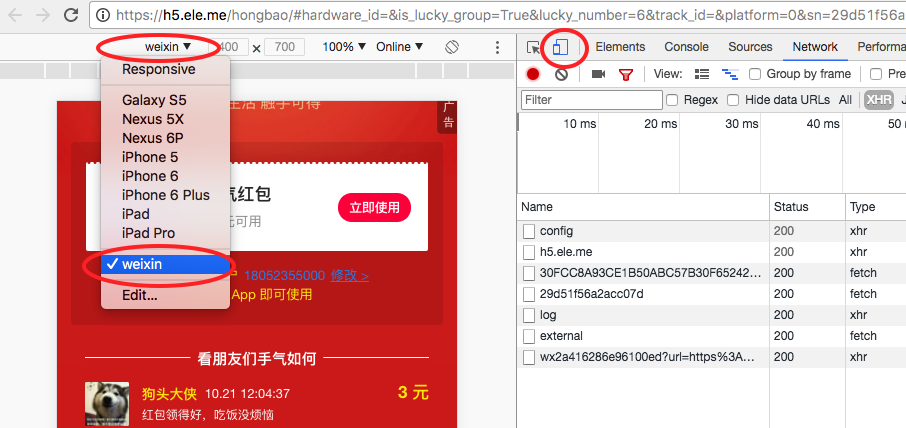
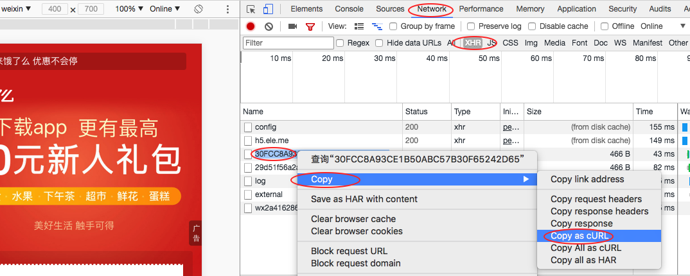

# 饿了么红包查看与领取

## 手机
* 下载手机QQ浏览器（IOS上6.9.1版本与Android上7.9版本测试OK, 其他版本为尝试）

* 打开红包链接, 登录QQ, 随便输一个手机号码, 比如 `18052355000`, 即可查看领取情况

## 电脑
* 下载Chrome, 添加模拟设备
	打开Chrome, 在任意页面右击—>检查, 打开开发者工具；
	

	打开settings
	


	Devices—>add custom device, 随便填写设备名称, 在userAgent 中填写如下内容,  添加保存
	
	```
	Mozilla/5.0 (iPhone 6s; CPU iPhone OS 9_3_3 like Mac OS X) AppleWebKit/601.1.46 (KHTML, like Gecko) Version/6.0 MQQBrowser/6.9.1 Mobile/13G34 Safari/8536.25 MttCustomUA/2
	```
	
	


* 打开地址
将饿了么红包的分享链接发送到电脑上, 用chrome打开, 打开开发者模式, 选择刚添加的设备刷新。然后操作同手机


## 自动领取
> 请求太频繁容易出错, 可能是被ele 服务器认为ddos攻击  

* 安装node.js环境, 运行项目
	
	```
	// 克隆项目
	git clone https://github.com/jackshawn/ele-hongbao
	
	// 安装依赖
	npm install
	
	// 运行
	npm run app
	
	// 浏览器打开 localhost:8080
	```

* 获取领取账号信息
确保chrome没有登录操作过，有的话清除历史记录。然后打开一个自己号码领取过的红包地址，登录qq，填自己的号码（用来领取的号码），在Network中拷贝如下请求信息。

	
	并将信息粘贴到工具的第一个输入框，点击设置按钮，操作正确的话会提示设置成功

* 在第二个框内输入你要抢的红包的地址，点击开始即可。
